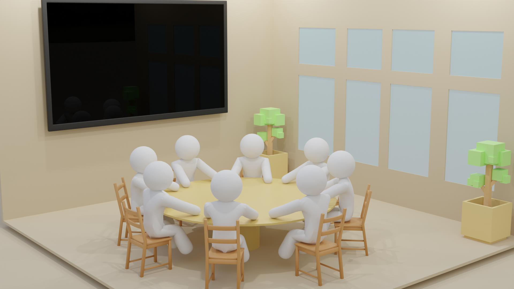

<h3 align="center" >Round Table</h3>

An simple online meeting application

</img>

## Introduction
This project is a simple online meeting applicaiton which use [**React.js**](https://reactjs.org/) as fronted framework and [**Express.js**](https://expressjs.com/) as backend. It relys on [**Socket.io**](https://socket.io/) to implement bidirectional and low-latency communication and use [**MongoDB**](https://www.mongodb.com/) as database.

## Install
### `npm install`
Install all dependencies packages.
### `npm start`
Runs the app in the development mode.\
Open [http://localhost:3000](http://localhost:3000) to view it in your browser.
Please change all address and ports before you run it.

## Features
### 3D representation
- Will be able to present the room and people in 3D use [**Three.js**](https://threejs.org/).
- Be able to perform basic gestures like rasing hand and clap.